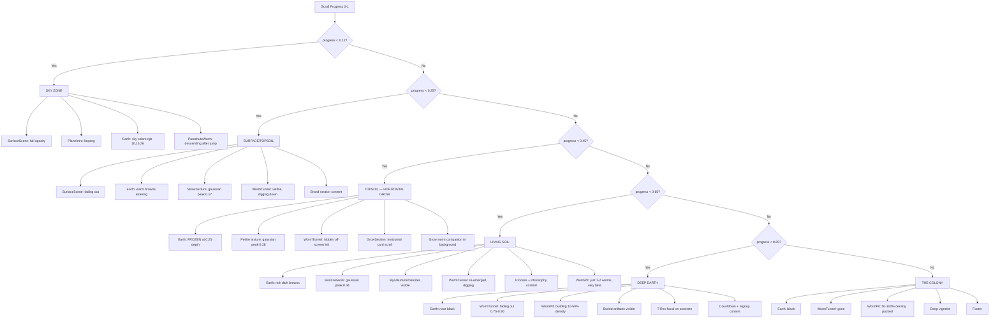

# Wurmz — Component Architecture & Layer Logic

## Why Each Layer Exists

Every visual element serves one of three purposes:
1. **World-building** — creates the continuous underground environment
2. **Narrative** — guides the user through the story (the worm, the content)
3. **Personality** — makes it uniquely Wurmz (graffiti, easter eggs, details)

Elements that don't serve one of these purposes are noise and should be removed.

---

## Layer Stack — From Back to Front

```
BACK (rendered first, behind everything)
│
├── z-[1] body::after — GRUNGE TEXTURE
│   WHY: Creates the raw, street-art feel across the entire site.
│   Without it, the dark backgrounds look sterile/digital.
│   DECISION: mix-blend-mode overlay so it enhances existing colors
│   rather than replacing them. Low opacity (0.28) so it's felt, not seen.
│
├── z-[2] UndergroundJourney — THE EARTH (background color field)
│   WHY: This IS the world. The continuous color spine is the foundation
│   everything else sits on top of. It makes the page feel like one
│   continuous environment instead of sections on a dark background.
│   DECISION: Fixed position so it stays behind content as you scroll.
│   44 color stops with cubic Hermite interpolation because fewer stops
│   create visible banding. Texture overlays (straw, perlite, roots)
│   are gaussian-gated to specific depth zones because real soil has
│   distinct layers.
│   CONTAINS: Color field, straw texture, perlite speckles, root network
│
├── z-[2] SoilBiology — SCIENTIFIC DETAILS
│   WHY: Rewards people who know soil science. Mycelium, nematodes,
│   mushrooms — these are real organisms in living soil. Subtle enough
│   to miss but accurate enough to impress.
│   DECISION: Same z-index as earth because they're part of the earth.
│   Gaussian-gated to living soil zone only.
│
├── z-[3] WormTunnel — THE WORM'S PATH (SVG)
│   WHY: The visual trail the worm digs through the earth. Shows where
│   the worm has been. Creates the literal "from the ground up" journey.
│   DECISION: Behind the worm pit (z-4) so colony worms can overlap
│   the tunnel trail. Absolute positioned with full page height so the
│   path spans the entire scroll distance. Fades out at 75-90% scroll
│   because the tunnel "ends" when the worm reaches the colony.
│   CONTAINS: Tunnel strokes, worm body (segmented), face, joint, smoke,
│   skateboard, easter egg graffiti
│
├── z-[4] WormPit — THE COLONY (canvas)
│   WHY: The payoff. The entire journey builds toward this. When you
│   reach the colony, you've arrived at what Wurmz is about — the
│   living underground. It should feel like looking through glass at
│   a worm bin.
│   DECISION: Canvas for performance (SVG can't handle 800 animated
│   worms). Fixed position so worms fill the viewport. Progressive
│   density tied to scroll — starts invisible, ends packed. Bottom-
│   heavy distribution because worms live at the bottom of bins.
│   CONTAINS: 800 animated worms, queen worm, golden worm
│
├── z-[5] BuriedArtifacts — HIDDEN TREASURES
│   WHY: Easter eggs that reward exploration. The RAW pack, lighter,
│   T-Rex skull — these are things buried in real soil. They make
│   the underground feel lived-in and real.
│   DECISION: Above the worm pit so fossils are visible through the
│   colony. Gaussian-gated to specific depths. Very low opacity so
│   they're discoveries, not decorations.
│
├── z-[7] SurfaceScene — THE SKY
│   WHY: The entry point. You start above ground. The sky establishes
│   "you are here" before descending underground. NYC skyline and
│   moon ground it in a specific place and time.
│   DECISION: Absolute positioned at the top, fades out with scroll.
│   Higher z-index than earth layers because the sky is literally
│   above the ground. Parallax on different elements creates depth
│   (stars move slowly, ground moves faster).
│   CONTAINS: Sky gradient, stars, moon (real phase), chemtrails,
│   NYC skyline, shooting star, ground fade
│
├── z-[8/14] ParachuteWorm — THE DESCENT
│   WHY: Bridges the sky and underground. The worm drops in, connecting
│   the two worlds. The parachute, skateboard, and backpack give the
│   character personality before you even see it digging.
│   DECISION: Fixed position tracking scroll. Fades at landing so
│   the tunnel worm can take over seamlessly.
│
├── z-[15] PlaneIntro — THE HOOK
│   WHY: The first thing you see. A beat-up biplane with a stoner
│   worm on the edge — it immediately tells you what kind of brand
│   this is. "Click to Jump" is the call to action that starts the
│   experience.
│   DECISION: Highest z-index among scene elements because the plane
│   must be clickable. Loops until clicked. Fades with scroll.
│
├── z-[20] main — ALL CONTENT
│   WHY: The actual information people need — brand story, grow
│   process, countdown, signup.
│   DECISION: z-20 ensures content is ALWAYS above all visual effects.
│   Each section has bg-deep-earth/90+ backdrop for readability.
│   Content exists WITHIN the earth, not on top of it.
│
├── z-[50] body::before — GRAIN OVERLAY
│   WHY: Fine noise texture that makes everything feel organic and
│   photographic rather than clean digital. Applied last so it
│   affects everything equally.
│   DECISION: Very high z-index but pointer-events:none so it never
│   blocks interaction. Low opacity (0.07).
│
└── z-[100] CinematicMode — AUTO-PLAY BUTTON
    WHY: Lets people watch the full experience hands-free. A "play"
    button for the website itself.
    DECISION: Highest z-index because it must always be accessible.
    Fixed bottom-right, low-profile design that doesn't distract.

FRONT (rendered last, on top of everything)
```

## Decision Tree — Scroll Progress → Visual State



## Key Architectural Decisions

### Why Fixed Position for Background Layers?
The earth, worm pit, and surface scene use `position: fixed` so they fill the viewport and stay behind scrolling content. This creates the illusion that you're moving through the earth while the earth stays still around you.

### Why Separate Canvas for Worms?
SVG can't efficiently animate 800 independent worm bodies with segment-level physics. Canvas gives us requestAnimationFrame-driven rendering at 60fps. The worm tunnel uses SVG because it's a static path that benefits from vector scaling.

### Why ScrollContext?
Before ScrollContext, every component listened to scroll events independently, computing slightly different progress values at slightly different times. This caused desync (tunnel ahead of worm, colors not matching). One source of truth eliminates this class of bugs entirely.

### Why Gaussian Opacity Curves?
Linear opacity changes create visible boundaries. Gaussian curves (bell curves) fade in and out smoothly with no detectable start/end point. This is why soil textures use `exp(-x²/2σ²)` instead of `if/else` opacity blocks.

### Why 44 Color Stops?
The human eye can detect ~1% brightness jumps in gradients. With fewer stops, the transitions between earth zones are visible as color bands. 44 stops with cubic Hermite interpolation ensures sub-1% changes between adjacent scroll frames.
